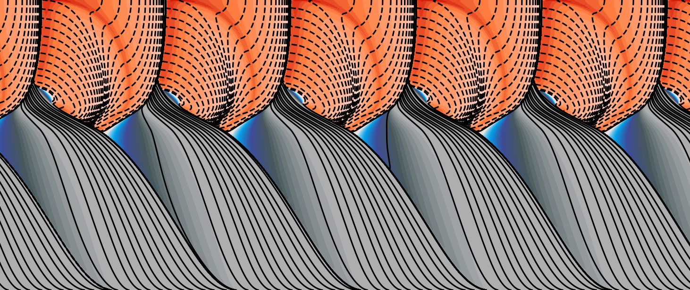

# FDEQSS_2D
PyTorch-based numerical simulation code for 2D Fully Dynamic Earthquake Sequence Simulation.



## Overview

This repository provides a numerical simulation framework for **fully dynamic earthquake sequence simulations** by coupling:

- Elastodynamics
- Rate-and-state friction (RSF) laws

The code enables long-term simulations of earthquake cycles within a unified physical framework, including:

- Inter-seismic stress accumulation
- Spontaneous nucleation of dynamic events
- Dynamic rupture propagation
- Post-seismic relaxation

The numerical scheme is mainly based on previous works:

- [Lapusta et al. (2000)](https://doi-org.kyoto-u.idm.oclc.org/10.1029/2000JB900250)
- [Noda (2021)](https://doi.org/10.1186/s40623-021-01465-6)
- [Romanet & Ozawa (2022)](https://doi-org.kyoto-u.idm.oclc.org/10.1785/0120210178)

This code is designed for **research use**, with a focus on:

- Reproducibility
- Computational efficiency

It supports rapid prototyping of new physical models and is suitable for large-scale simulations on modern hardware.


## Currently available physics

### Medium
- Linearly elastic uniform body

### Boundary Conditions
- Infinite space
- Half space

### Geometry
- Flat fault

### Rupture Modes
- Mode I (opening)
- Mode II (in-plane problem)
- Mode III (anti-plane problem)
- Crustal plane model

### On-fault Constitutive Laws
- RSF law, **regularized form** with aging law
- RSF law, **standard form** with aging law


<details>
<summary><h2>Installation</h2></summary>

This project uses Docker to provide a fully reproducible runtime environment.  
You do not need to manually install Python or any dependencies, and your local environment is not contaminated.

### 1. Install Docker
First, install Docker on your system:

https://www.docker.com/get-started

### 2. Pull Docker image
The simulation environment is distributed as a pre-built Docker image.  
**Note**: The Docker image is approximately **20 GB** in size.  
Please ensure that you have sufficient disk space.

#### For arm64 machines:
```bash
docker pull reiju123/sbiem:latest
```

#### For x86_64 machines:
```bash
docker pull reiju123/sbiem_x86_64:latest
```

You can verify the installation:
```bash
docker images
```

### 3. Clone this repository
Clone the source code from GitHub:
```bash
git clone https://github.com/ReijuNorisugi/FDEQSS_2D.git
cd FDEQSS_2D
```

If you want to reproduce results from specific publications or stable versions,
please checkout a tagged release:
```bash
git checkout v0.3.1
```

Tag v0.3.1 is the latest stable version.  
The correspondance between each tag and version is summarized in Tags at the top.
</details>


<details>
<summary><h2>Directory structure generated by a simulation</h2></summary>

```text
FDEQSS_2D/                     # Home directory for simulation.
│
├── Main_test.py               # Entry point for running simulations.
│
├── sbiem_modules/             # Core numerical solvers and physics modules.
│   ├── constitutive_law/      # Solvers for each constitutive law.
│   ├── convolution/           # Green's function convolution and history update.
│   └── integrator/            # Organizer of predictory correcter integration.
│   └── kernel/                # Prepare the table of Green's function.
│   └── manager/               # Manager of output and time stepping.
│   └── quality_control/       # Warning if configuration is invalid.
│   └── record/                # Recorder of output files.
│   └── time_step/             # Resolve adaptive step size.
│   └── utils/                 # Utility.
│   └── visualize_initial/     # Plotting initial conditions when Initial==True.
│   └── driver.py              # Simulation driver. Resolve module dependencies.
│
├── Figures/                   # Configuration script, visualization script, and figure outputs.
│   ├── reg_RSF_AG/            # Constitutive laws' name.
│   │   └── test/
│   │       ├── _params_RSF.py # Configuration script.
│   │       └── Analyze_RSF.py # Visualization script.
│   └── ...
│
├── Output/                   # Simulation outputs (generated automatically).
│   └── reg_RSF_AG/
│       └── test/
│
├── Restart/                  # Restart files (generated automatically).
│   └── reg_RSF_AG/
│       └── test/
│
├── Log/                      # Simulation logs (generated automatically).
│   └── reg_RSF_AG/
│       └── test/
└──
```
</details>


<details>
<summary><h2>Test run with an example script</h2></summary>

After installing the docker image and cloning this repository, you can run the example simulaiton.  
At first, let's try [the SCEC community benchmark problem BP1-FD](https://strike.scec.org/cvws/seas/benchmark_descriptions.html).  
This is mode III problem in a half infinite space. Constitutive law is regularized form of RSF and aging laws.  
It will take a couple of minutes on a laptop.

#### For arm64 machines:
```bash
docker run --rm \
  -v $(pwd):$(pwd) \
  -w $(pwd) \
  reiju123/sbiem:latest \
  conda run -n sbiem python3 -u Main_test.py
```

#### For x86_64 machines:
```bash
docker run --rm \
  -v $(pwd):$(pwd) \
  -w $(pwd) \
  reiju123/sbiem_x86_64:latest \
  conda run -n sbiem python3 -u Main_test.py
```

If you have an NVIDIA GPU and NVIDIA Container Toolkit installed,
you can enable GPU acceleration:
#### GPU acceleration (optional):
```bash
docker run --rm \
  --gpus all \
  -v $(pwd):$(pwd) \
  -w $(pwd) \
  reiju123/sbiem:latest \
  conda run -n sbiem python3 -u Main_test.py
```

The simulation is executed inside the pre-configured Conda environment included in the Docker image.
</details>

<details>
<summary><h2>Checking outputs</h2></summary>

When example scripts are properly executed, you can check the log file log_yyyymmdd_hh.log:
```bash
cd Log/reg_RSF_AG/test
```

You will see the following log including simulation condition and time stamp of dynamic events:
```text
********************************
/reg_RSF_AG/test/

 * Computational conditions *

 *  Fully dynamic
 *  Mirror
 *  Constitutive law = reg_RSF_AG
 *  Rupture mode = III
 *  Stepper = LR
 
 * Coordinate setting *

 *  Domain size = 80.0 km
 *  Fault size = 40.0 km
 *  Replication = 2
 *  Tw = 23.094688221709006 sec
 *  dtmin = 11.27670323325635 msec

 * Output conditions * 

 * Sparse Bulk output is available
 * Dense station output is available
 * EQ snapshot is available

 *  h*RR / h = 10.3
 *  h*RA / h = 25.1
 *  At least > 20 will be fine, > 40 will be nicely resolved

 *  Lambda0 / h = 3.9
 *   At least > 3 is required.
 *  hcell = 78.125

*************************************************

EQ = 1 ..... t = 6202937409.699303 sec ..... prog = 0.131
EQ = 2 ..... t = 9643446226.017618 sec ..... prog = 0.204
EQ = 3 ..... t = 13371953925.885927 sec ..... prog = 0.283
EQ = 4 ..... t = 16940256599.468243 sec ..... prog = 0.358
EQ = 5 ..... t = 20578534310.861343 sec ..... prog = 0.435
EQ = 6 ..... t = 24201135013.98633 sec ..... prog = 0.512
EQ = 7 ..... t = 27745446191.138847 sec ..... prog = 0.587
EQ = 8 ..... t = 31392970161.29394 sec ..... prog = 0.664
EQ = 9 ..... t = 35012935927.11742 sec ..... prog = 0.740
EQ = 10 ..... t = 38560859187.144684 sec ..... prog = 0.815
EQ = 11 ..... t = 42218375798.39385 sec ..... prog = 0.892
EQ = 12 ..... t = 45832227928.83376 sec ..... prog = 0.969

*************************************************

Consuming time 103.62035083770752 sec
63216 time steps
12 quakes

Restart files are saved.
```

Outputs are saved in the following directory:
```bash
cd ../../..
cd Output/reg_RSF_AG/test
```

By default, files for restarting the simulation are saved in the following directory:
```bash
cd Restart/reg_RSF_AG/test
```
</details>


<details>
<summary><h2>Visualizing the test example</h2></summary>

Python script for quick visualization of simulation results Analyze_RSF.py is provided at Figures/reg_RSF_AG/test/.  
This script reads the output from Output/reg_RSF_AG/test/, so make sure that the test run has been completed.


#### For arm64 machines:
```bash
docker run --rm \
  -v $(pwd):$(pwd) \
  -w $(pwd) \
  reiju123/sbiem:latest \
  conda run -n sbiem python3 -u Figures/reg_RSF_AG/test/Analyze_RSF.py
```

#### For x86_64 machines:
```bash
docker run --rm \
  -v $(pwd):$(pwd) \
  -w $(pwd) \
  reiju123/sbiem_x86_64:latest \
  conda run -n sbiem python3 -u Figures/reg_RSF_AG/test/Analyze_RSF.py
```

You can obtain the slip evolution, trajectories, fault snapshots, source parameters, etc.  
Figures are saved in PNG at:
```bash
Figures/reg_RSF_AG/test/
```
</details>


<details>
<summary><h2>Other examples</h2></summary>

Test scripts for running other example simulations are provided:  
- RSF and aging laws of the standard form:
```bash
Figures/RSF_AG/test/
```
</details>


<details>
<summary><h2>How to run your own simulations</h2></summary>

To run custom simulation, you need to configure the parameter file '**_params_RSF.py**'.  

For test example, the file is located at:
```bash
Figures/reg_RSF_AG/test/
```

This file is read by **Main_test.py**, which controrls the escecution of simulations.

To create your own simulation setup, you can modify '**_params_RSF.py**' and '**Main_test.py**'.  

For example, you may create a new directory such as:
```bash
Figures/RSF_AG/Project_xxx/case_1/
```
and place a customized '**_params_RSF.py**' there.  

The variable '**fname**' in both '**Main_test.py**' and '**_params_RSF.py**' must match the directory name:
```bash
Figures/RSF_AG/Project_xxx/case_1/
```

Directories of the same name is automatically created under Output/ and Log/ and used to store outputs and logs of simulations.

After modifying the parameter files, run the simulation using the same Docker command as shown in the test run section.  
</details>


<details>
<summary><h2>Please cite this repository !</h2></summary>

If you use this code to produce scientific results, please cite this repository as follows:

```text
The numerical simulations were performed using the open-source code
FDEQSS_2D (Norisugi, 2026), available at xxxxx
```

</details>

<details>
<summary><h2>References</h2></summary>

- [Lapusta, N., Rice, J. R., Ben‐Zion, Y., & Zheng, G. (2000). Elastodynamic analysis for slow tectonic loading with spontaneous rupture episodes on faults with rate‐and state‐dependent friction. Journal of Geophysical Research: Solid Earth, 105(B10), 23765-23789.](https://doi-org.kyoto-u.idm.oclc.org/10.1029/2000JB900250)

- [Noda, H. (2021). Dynamic earthquake sequence simulation with a SBIEM without periodic boundaries. Earth, Planets and Space, 73(1), 137.](https://doi.org/10.1186/s40623-021-01465-6)

- [Romanet, P., & Ozawa, S. (2022). Fully dynamic earthquake cycle simulations on a nonplanar fault using the spectral boundary integral element method (sBIEM). Bulletin of the Seismological Society of America, 112(1), 78-97.](https://doi-org.kyoto-u.idm.oclc.org/10.1785/0120210178)
</details>